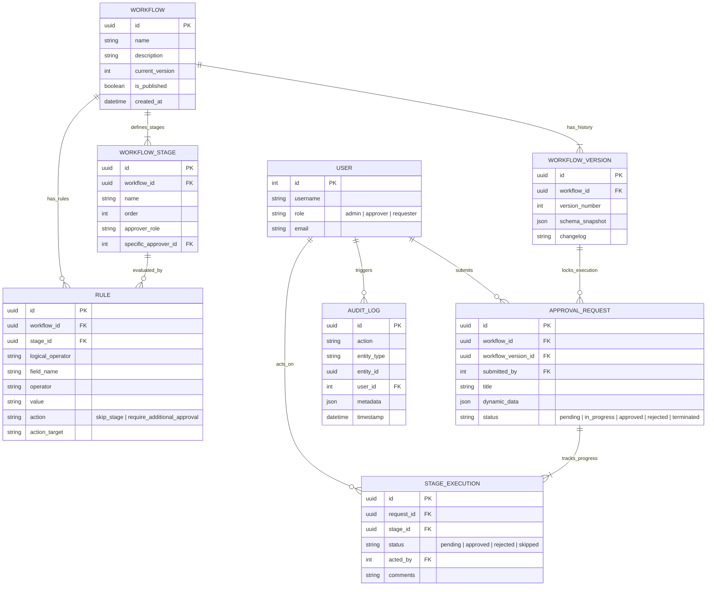

# Dynamic Approval Workflow Engine

A full-stack application built with React and Django REST Framework for creating, managing, and executing dynamic approval workflows. This system allows administrators to define multi-stage approval processes with complex rule-based routing, without modifying application code.

## Live Deployments
* **Frontend Web Application (Vercel):** https://approve-task.vercel.app
* **Backend API (Render):** https://approve-task.onrender.com

*(Note: The database is hosted on the free tier of NeonDB and the backend is on Render's free tier. Initial requests may experience a 30-50 second delay due to cold-starts).*

---

## Quick Setup Instructions

### Prerequisites
- Python 3.12+
- Node.js 18+
- npm or yarn

### 1. Backend Setup (Django)

```bash
cd backend

# Create and activate virtual environment
python -m venv venv
# On Windows:
venv\Scripts\activate
# On Mac/Linux:
source venv/bin/activate

# Install dependencies
pip install -r requirements.txt

# Run migrations
python manage.py migrate

# Load seed data (optional but recommended for testing)
python manage.py seed_data

# Start the server
python manage.py runserver
```
The backend API will be running on `http://127.0.0.1:8000`.

### 2. Frontend Setup (React)

```bash
cd frontend

# Install dependencies
npm install

# Start the development server
npm run dev
```
The frontend application will be running on `http://localhost:5173`.


## Architecture, Project Decisions & Core Logic

To ensure the application scales securely and efficiently, several enterprise-grade architectural decisions and logic rules were implemented to satisfy all complex requirements.

### 1. Backend Architecture (Django + DRF)
* **Stateless JWT Authentication & RBAC:** The system uses JSON Web Tokens (JWT) for authentication to eliminate server-side session overhead. Role-Based Access Control (RBAC) is enforced at the API level (Admin, Approver, Requester) to restrict endpoints strictly to authorized users.
* **Normalized Database & Optimized Queries:** The PostgreSQL database is fully normalized to 3NF. Django's `select_related` and `prefetch_related` are aggressively utilized to prevent N+1 query problems when fetching workflows and their deeply nested stages/rules.
* **Database Transactions & Concurrent Conflicts:** All critical state changes (like submitting an approval or publishing a workflow) are wrapped in `transaction.atomic()`. To prevent **concurrent approval conflicts** (e.g., two people approving a stage at the exact same millisecond), the system uses `select_for_update()` row-level database locking.
* **Immutable Audit Logging:** An append-only `AuditLog` table tracks every single entity creation, update, and action to ensure full enterprise compliance. Actions can never be silently overwritten.

### 2. Frontend Engineering (React + Vite)
* **Component-Driven UI:** Built with Shadcn UI and TailwindCSS for a highly responsive, modern, dark-mode accessible interface.
* **Optimistic UI & State Management:** Zustand is used for global state, while TanStack Query manages server state (caching, pagination, and invalidation). This ensures loading states, empty states, and error validations are handled gracefully.
* **Polished Micro-Interactions:** Framer Motion is utilized throughout the dashboard to provide smooth page transitions, list animations, and interactive feedback.

### 3. Solving the Logic Challenges

#### The Dynamic Rule Engine (Nested Conditions)
* **Challenge:** Determine skipped stages dynamically based on complex, nested JSON data.
* **Solution:** When a request is submitted, its dynamic JSON payload is parsed against the active `Rule` models for that workflow. The engine dynamically maps string operators (e.g., `>` , `==`) to Python's built-in `operator` module to evaluate conditions on the fly. If a skip rule evaluates to `True`, the execution engine flags that stage as `skipped` and instantly calculates and routes to the next valid approver in the sequence.

#### Immutable Versioning & Safe Rollbacks
* **Challenge:** Allow workflow modifications without breaking active requests, and allow requests to rollback safely.
* **Solution:** The system employs a `WorkflowVersion` model. Publishing a workflow takes a JSON snapshot of its exact schema (stages, rules). Active requests are strictly bound to a Version ID. If an admin edits a workflow, it does not affect pending requests. If a request is rejected, it can safely rollback to a previous step by traversing the immutable `StageExecution` history.

#### Preventing Circular Workflows & Infinite Loops
* **Challenge:** Ensure admins cannot build workflows that loop infinitely or duplicate stages.
* **Solution:** The Workflow Builder enforces linear Directed Acyclic Graph (DAG) structures. The backend validates the `order` integers of all stages upon publication to ensure strictly monotonic ascending sequences. The execution engine enforces that a workflow only moves forward (or terminates backwards), mathematically preventing infinite loops.

---

## Entity-Relationship (ER) Diagram

Below is the database architecture powering the workflow engine.



---

## API Documentation & Postman

The backend API is fully documented via OpenAPI (Swagger).

1. **Swagger UI**: Start the django server and navigate to `http://127.0.0.1:8000/api/docs/` for an interactive UI to test the endpoints.
2. **ReDoc**: Available at `http://127.0.0.1:8000/api/redoc/`.
3. **Postman Collection**: A `postman_collection.json` file is located in the `backend/` directory. You can import this directly into Postman to instantly access all configured endpoints.

## Tech Stack
- **Frontend**: React 18, TypeScript, TailwindCSS, Framer Motion, Shadcn UI, Vite.
- **Backend**: Python 3.12, Django 5.x, Django REST Framework.
- **Database**: Neon(Postgres - may experience delay due to cold start) fallback to sqlite3.
