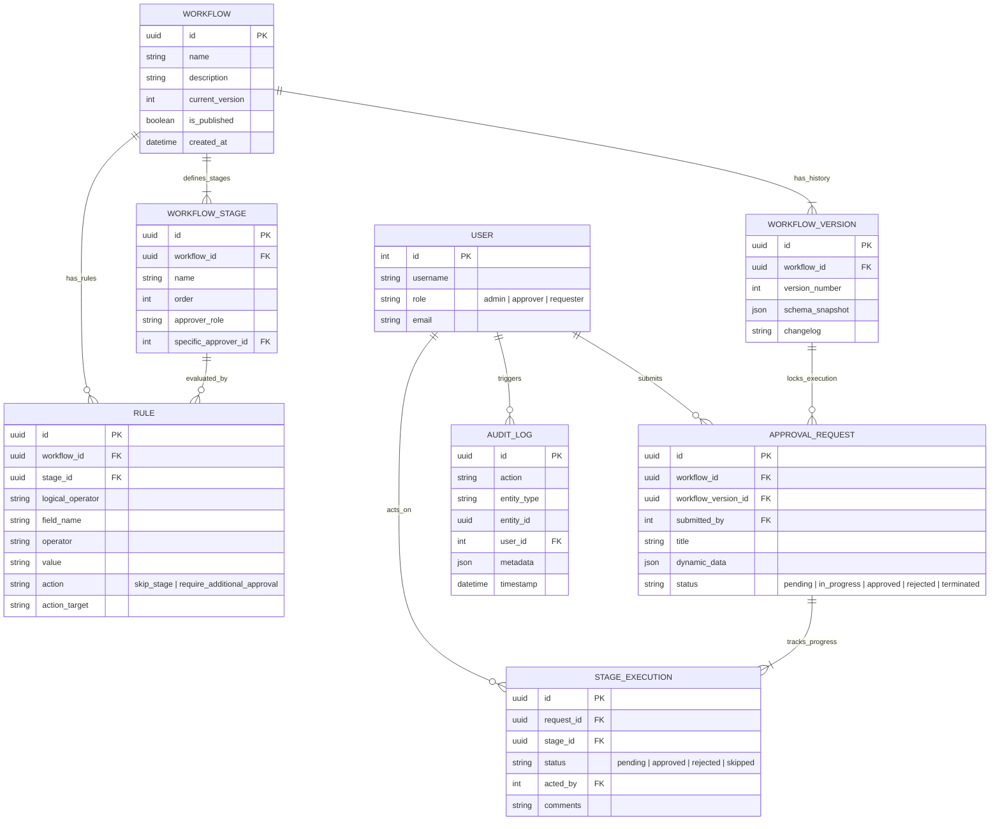

# Dynamic Approval Workflow Engine

A full-stack application built with React and Django REST Framework for creating, managing, and executing dynamic approval workflows. This system allows administrators to define multi-stage approval processes with complex rule-based routing, without modifying application code.

## Quick Setup Instructions

### Prerequisites
- Python 3.12+
- Node.js 18+
- npm or yarn

### 1. Backend Setup (Django)

```bash
cd backend

# Create and activate virtual environment
python -m venv venv
# On Windows:
venv\Scripts\activate
# On Mac/Linux:
source venv/bin/activate

# Install dependencies
pip install -r requirements.txt

# Run migrations
python manage.py migrate

# Load seed data (optional but recommended for testing)
python manage.py seed_data

# Start the server
python manage.py runserver
```
The backend API will be running on `http://127.0.0.1:8000`.

### 2. Frontend Setup (React)

```bash
cd frontend

# Install dependencies
npm install

# Start the development server
npm run dev
```
The frontend application will be running on `http://localhost:5173`.


## Entity-Relationship (ER) Diagram

Below is the database architecture powering the workflow engine.



---

## API Documentation & Postman

The backend API is fully documented via OpenAPI (Swagger).

1. **Swagger UI**: Start the django server and navigate to `http://127.0.0.1:8000/api/docs/` for an interactive UI to test the endpoints.
2. **ReDoc**: Available at `http://127.0.0.1:8000/api/redoc/`.
3. **Postman Collection**: A `postman_collection.json` file is located in the `backend/` directory. You can import this directly into Postman to instantly access all configured endpoints.

## Tech Stack
- **Frontend**: React 18, TypeScript, TailwindCSS, Framer Motion, Shadcn UI, Vite.
- **Backend**: Python 3.12, Django 5.x, Django REST Framework.
- **Database**: Neon(Postgres - may experience delay due to cold start) fallback to sqlite3.
